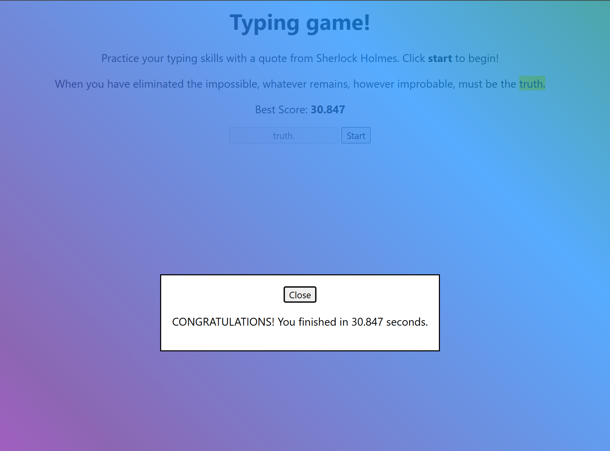
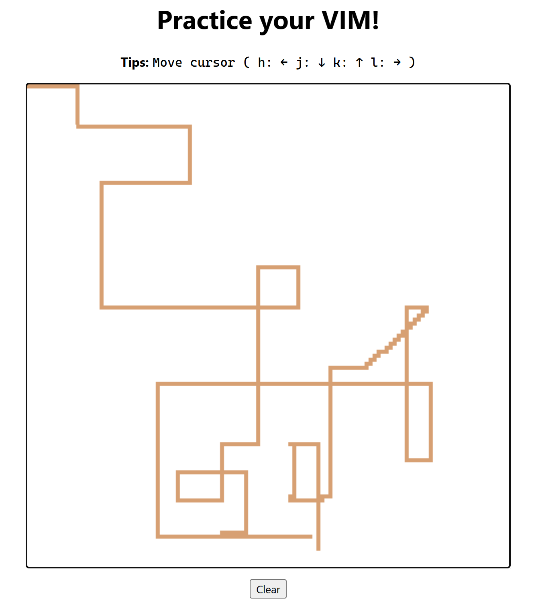
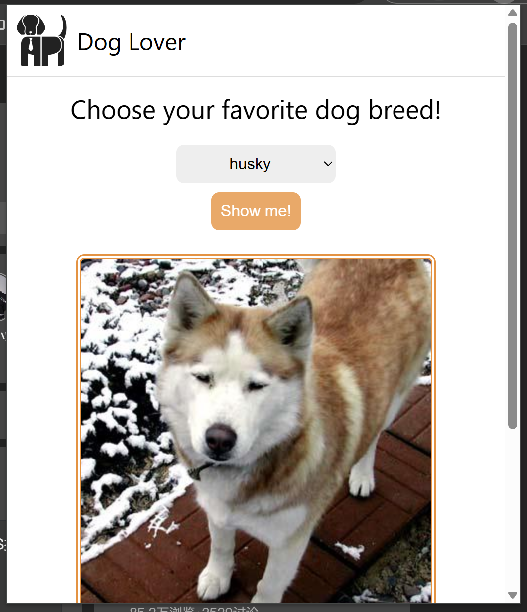
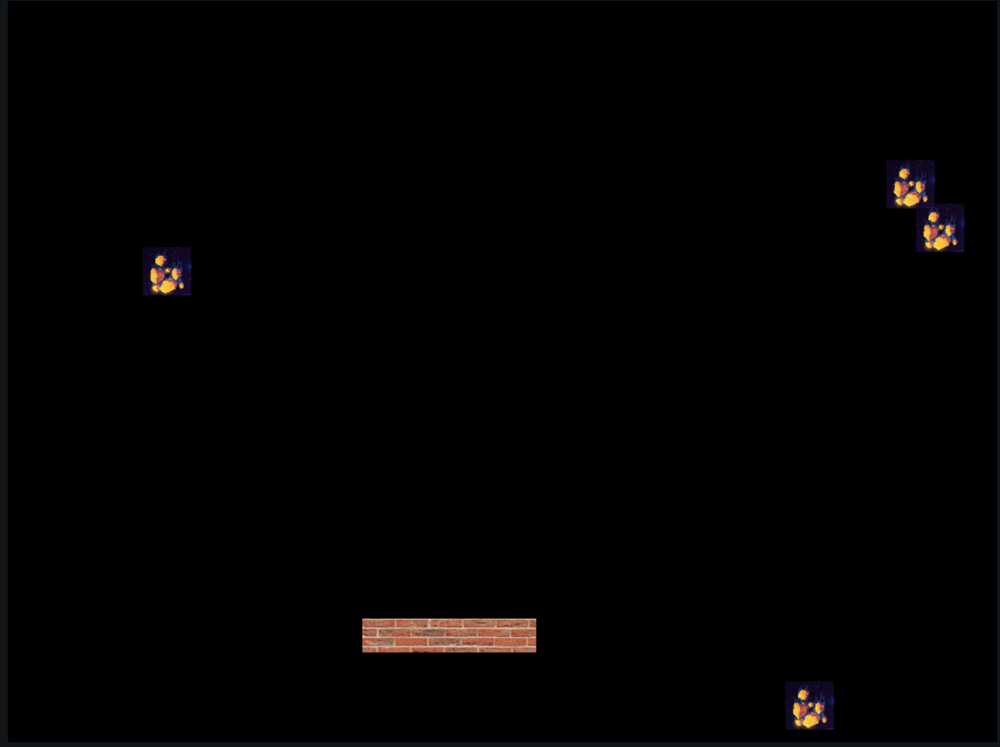

# Web-Dev-Learning

This repository is for self-learning Web Development according to [Microsoft Web Dev Tutorial](https://microsoft.github.io/Web-Dev-For-Beginners/#/). Some source code is from the tutorial but has been modified.

## Typing Game: Practicing typing words

## Pixel Game: Using vim keyboard to draw in a canvas

## Dog Image: An Chrome/Edge extension can explore cute dog pics according to breed selected

## Meteor-hitting-earth: Protect earth from the falling meteors

